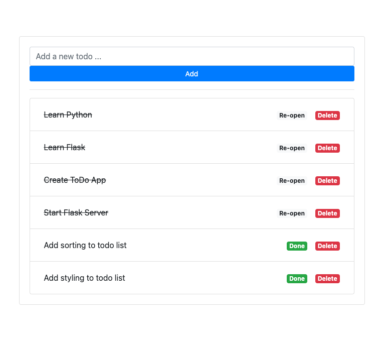
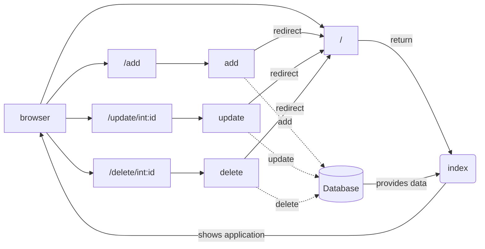

I was learning to work with Flask, SQLAlchemy and WTForms so I created this 
simple todo app as reference to my future self and starting point for new apps. 
This example can be easily expanded to add new functions.

# Setting up initial install

Let's start by cloning this repo:

```bash
$ git clone https://github.com/KingOfSpades/flaskTodoAppDemo.git
$ cd flaskTodoAppDemo
```

As always you should start with an empty `venv`, activate it and install the 
required dependancys:

```bash
$ python3 -m venv .venv
$ source .venv/bin/activate
$ pip install -r requirements.txt
```

Now you can fill initalize the database with some dummy data by using `make`:

```bash
$ make database
```

This will create the inital database we need with some sample todo's. Have a look
in `flaskr/initDB.py` if you want to see what's going on.

Now start the app with `make` or run it manually:

```bash
$ make run
```

This will start the app on: http://127.0.0.1:5000. You should now see this 
beautifull todo app:



# Explaining the app

This is easy app tha relies on one (1) database model, a FlaskForm and four (4)
routes to handle requests:

- `/` route handels returinging the main page and index
- `/add` route is used to add new todo's
- `/update` route is used to update a todo based on the provided `id`. In our 
case it togles the done status of a todo
- `/delete` route deletes a todo based on the provide `id`

## Diagram overview



## Forms

The app uses a single form linked to a class to generate the add form:

```python
# flaskr/app.py
...
# Todo form for adding items
class TodoForm(FlaskForm):
  todo = StringField("Todo")
  submit = SubmitField("Add")
...
```

This form is then renderd in the `index.html` template:

```html
# flaskr/templates/index.html
...
<form method="POST" action="/add" class="input-group">
  <div class="form-outline flex-fill">
  {{ template_form.hidden_tag() }}
    {{ template_form.todo(
      class_='form-control',
      placeholder='Add a new todo ...',
      required='required'
      ) 
    }}
    {{ template_form.submit(class_='btn btn-primary btn-sm  btn-block') }}
  </div>
</form>
...
```

## Database

The database consists of a simple class to hold an `id`, `todo_text` and the
state of the Todo (completed, `True` or `False`):

```python
# flaskr/app.py
# Todo class/model for holding todo's
class Todo(db.Model):
  id = db.Column(db.Integer, primary_key = True)
  todo_text = db.Column(db.String(256), index = True)
  completed = db.Column(db.Boolean, unique=False, default=False)
```

## Updating todo's

This is simply done by rendering the target URL + todo ID, for example:

```bash
/delete/{{ todo.id }}
```